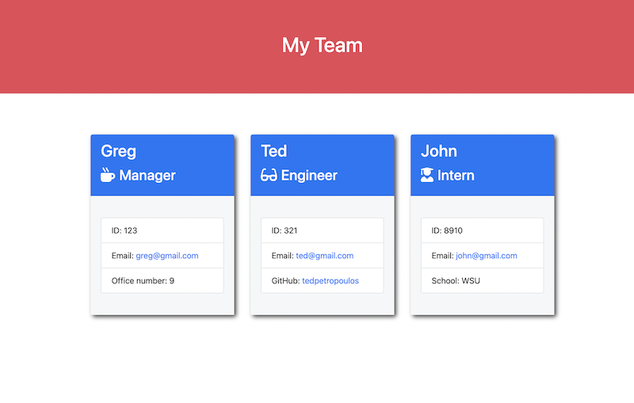

# Team-Manager

# What is Team Manager about?

-
- This is a management application for Employeers or team leaders which was built with node.js and run in command line
- A leader or employer can add employees and create a team
- The created team will have a set of information about each employee.
- The employer can see the Role, name, id, github, email, office number and school for the employees.

# License

- This application has MIT license
- This application is free of any charge and copy right allowed for everone

# How to use it?

- [Watch-Video](https://drive.google.com/file/d/1ey37HnG6HwewI5GuR0pFb_TH75Y_B_sV/view)

* This application run in command line with "node index.js" command
* Then you will face with a set of questions about employees
* You have the option to add a new employee or finish creating the team.
* after selecting the Create Team option, it will create a html file.
* the html file will contain the team of added employees with their informations

# How does it look like

- 

# Technologies Used

- HTML
- CSS
- Javascript
- Node.js
- bootstrap
- ES6
